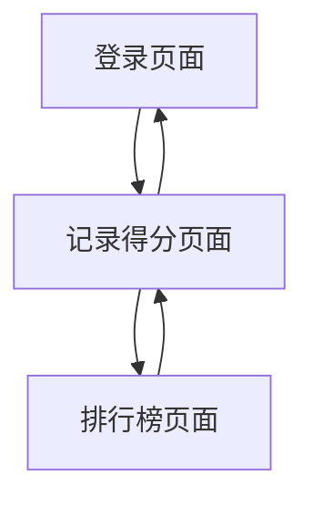

## 1. 产品概述
公司掼蛋大赛微信小程序，用于记录参赛队伍的比赛得分和排名。参赛队伍通过扫码或输入队名登录，登记每轮对手信息和得分，支持实时查看所有队伍得分排行榜。

## 2. 核心功能

### 2.1 用户角色
| 角色 | 注册方式 | 核心权限 |
|------|----------|----------|
| 参赛队伍 | 扫码登录或输入队名 | 记录比赛得分、查看排行榜 |

### 2.2 功能模块
掼蛋比赛微信小程序包含以下核心页面：
1. **登录页面**：扫码登录、手动输入队名
2. **记录得分页面**：选择轮次、输入对手队名、记录本队得分
3. **排行榜页面**：显示所有队伍总积分排名

### 2.3 页面详情
| 页面名称 | 模块名称 | 功能描述 |
|----------|----------|----------|
| 登录页面 | 扫码登录 | 扫描二维码快速登录，自动获取队伍信息 |
| 登录页面 | 手动登录 | 输入队伍名称进行登录验证 |
| 记录得分页面 | 轮次选择 | 选择第1-3轮中的任意一轮 |
| 记录得分页面 | 对手信息 | 输入对手队伍名称 |
| 记录得分页面 | 得分记录 | 选择本队达到的牌级（2-A对应2-14分） |
| 记录得分页面 | 提交确认 | 确认提交本轮得分记录 |
| 排行榜页面 | 总积分排行 | 按3轮累计积分降序显示所有队伍排名 |
| 排行榜页面 | 轮次详情 | 点击查看各队每轮得分详情 |

## 3. 核心流程
用户操作流程：
1. 参赛队伍通过扫码或输入队名登录系统
2. 进入记录得分页面，选择当前轮次（1-3轮）
3. 输入对手队伍名称，选择本队达到的牌级
4. 系统自动计算得分（2-A对应2-14分）
5. 提交本轮得分记录
6. 随时查看排行榜了解所有队伍总积分排名

## 4. 用户界面设计

### 4.1 设计风格
- **主色调**：深绿色（#1A472A）体现棋牌竞技氛围
- **辅助色**：金色（#FFD700）用于强调得分和排名
- **按钮样式**：圆角矩形，绿色背景配白色文字
- **字体**：微信小程序默认字体，标题18px，正文14px
- **布局风格**：卡片式布局，清晰分隔各功能模块
- **图标风格**：使用微信官方图标库，简洁明了

### 4.2 页面设计概述
| 页面名称 | 模块名称 | UI元素 |
|----------|----------|----------|
| 登录页面 | 扫码区域 | 居中显示二维码扫描框，大小200x200px |
| 登录页面 | 输入框 | 圆角输入框，placeholder显示"请输入队伍名称" |
| 记录得分页面 | 轮次选择器 | 底部弹出选择器，显示"第1轮"、"第2轮"、"第3轮" |
| 记录得分页面 | 牌级选择 | 网格布局显示2-A的牌级按钮，选中状态高亮显示 |
| 排行榜页面 | 排名列表 | 每行显示排名、队名、总积分，前三名特殊标识 |

### 4.3 响应式设计
微信小程序原生适配各种手机屏幕尺寸，采用rpx单位确保在不同设备上的显示效果一致。重点优化触摸交互体验，按钮点击区域不小于44x44px。