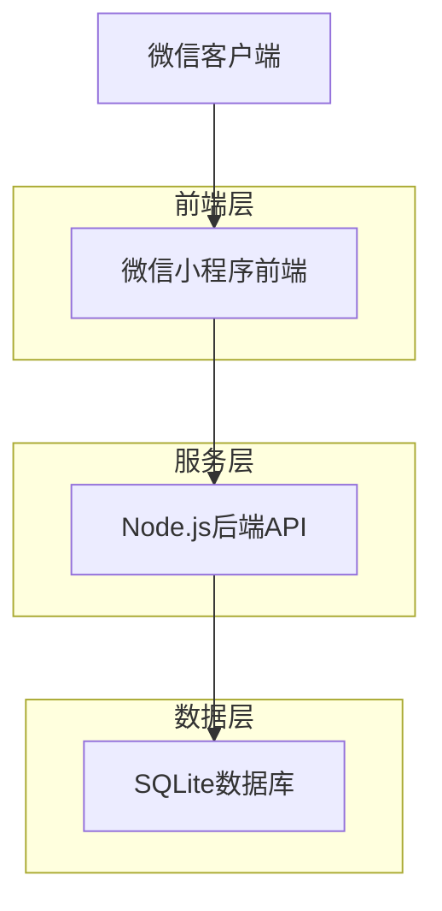
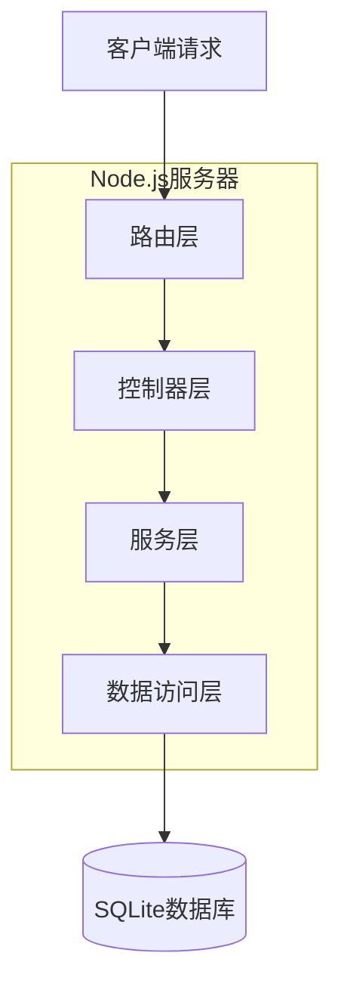
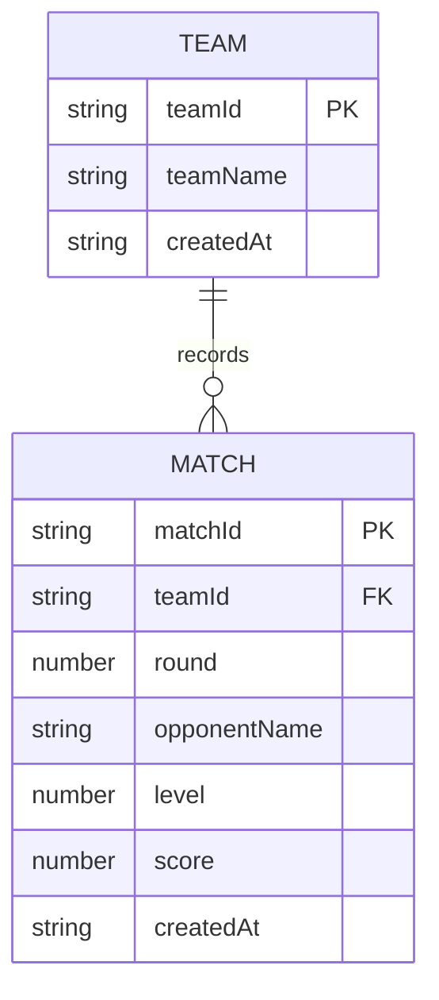

## 1. 架构设计



## 2. 技术描述

- **前端**: 微信小程序原生开发
- **后端**: Node.js@18 + Express@4
- **数据库**: SQLite3
- **部署**: 微信小程序云开发或自建服务器

## 3. 路由定义

| 路由 | 用途 |
|------|------|
| /api/teams/login | 队伍登录验证 |
| /api/matches/record | 记录比赛得分 |
| /api/matches/leaderboard | 获取排行榜数据 |
| /api/matches/team/:teamId | 获取指定队伍比赛记录 |

## 4. API定义

### 4.1 队伍登录
```
POST /api/teams/login
```

请求参数：
| 参数名 | 类型 | 必填 | 描述 |
|--------|------|------|------|
| teamName | string | 是 | 队伍名称 |
| qrCode | string | 否 | 二维码内容 |

响应参数：
| 参数名 | 类型 | 描述 |
|--------|------|------|
| teamId | string | 队伍唯一标识 |
| teamName | string | 队伍名称 |
| token | string | 登录凭证 |

### 4.2 记录比赛得分
```
POST /api/matches/record
```

请求参数：
| 参数名 | 类型 | 必填 | 描述 |
|--------|------|------|------|
| teamId | string | 是 | 队伍ID |
| round | number | 是 | 轮次（1-3） |
| opponentName | string | 是 | 对手队伍名称 |
| level | number | 是 | 达到的牌级（2-14） |

响应参数：
| 参数名 | 类型 | 描述 |
|--------|------|------|
| success | boolean | 操作是否成功 |
| score | number | 本轮得分 |
| totalScore | number | 总积分 |

### 4.3 获取排行榜
```
GET /api/matches/leaderboard
```

响应参数：
| 参数名 | 类型 | 描述 |
|--------|------|------|
| rankings | array | 排行榜数据 |

排行榜数据项：
| 参数名 | 类型 | 描述 |
|--------|------|------|
| rank | number | 排名 |
| teamName | string | 队伍名称 |
| totalScore | number | 总积分 |
| rounds | array | 各轮得分详情 |

## 5. 服务器架构图



## 6. 数据模型

### 6.1 数据模型定义



### 6.2 数据定义语言

队伍表（teams）
```sql
-- 创建队伍表
CREATE TABLE teams (
  team_id TEXT PRIMARY KEY,
  team_name TEXT UNIQUE NOT NULL,
  created_at DATETIME DEFAULT CURRENT_TIMESTAMP
);

-- 创建队伍索引
CREATE INDEX idx_teams_name ON teams(team_name);
```

比赛记录表（matches）
```sql
-- 创建比赛记录表
CREATE TABLE matches (
  match_id TEXT PRIMARY KEY,
  team_id TEXT NOT NULL,
  round INTEGER NOT NULL CHECK (round >= 1 AND round <= 3),
  opponent_name TEXT NOT NULL,
  level INTEGER NOT NULL CHECK (level >= 2 AND level <= 14),
  score INTEGER NOT NULL,
  created_at DATETIME DEFAULT CURRENT_TIMESTAMP,
  FOREIGN KEY (team_id) REFERENCES teams(team_id)
);

-- 创建比赛记录索引
CREATE INDEX idx_matches_team ON matches(team_id);
CREATE INDEX idx_matches_round ON matches(round);
CREATE UNIQUE INDEX idx_team_round ON matches(team_id, round);
```

初始化数据
```sql
-- 插入示例队伍
INSERT INTO teams (team_id, team_name) VALUES 
('team001', '雄鹰队'),
('team002', '猛虎队'),
('team003', '飞鹰队');
```